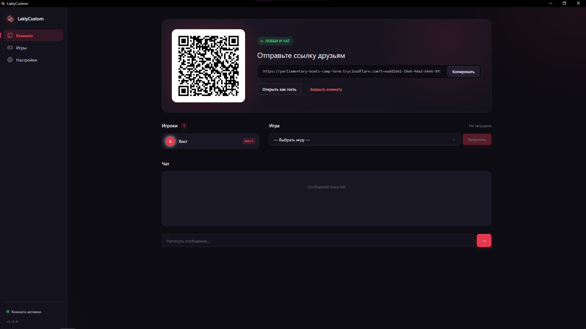
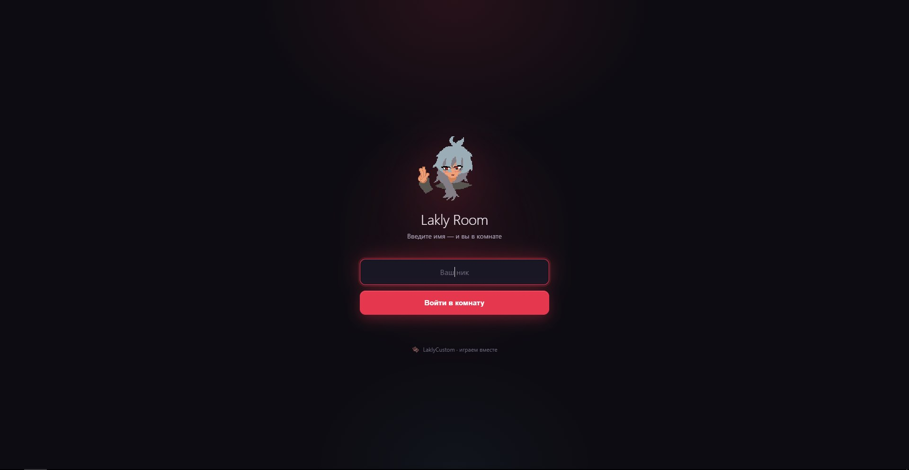

<div align="center">

# LaklyCustom

### Turn localhost into a multiplayer room.

Create a room. Share the link. Play together.

[](https://www.electronjs.org/)
[](https://nodejs.org/)
[](https://socket.io/)
[](https://developers.cloudflare.com/cloudflare-one/connections/connect-networks/)
[](LICENSE)

[Features](#-features) · [Quick start](#-quick-start) · [Room modes](#-three-room-modes) · [Plugins](#-plugins) · [Security](#-security)

</div>

---

<div align="center">

<p>
  
</p>
<p>
  
</p>

<sub>Host creates a room and shares the link · Guests join from any browser</sub>

</div>

---

## ✨ Features

<table>
<tr>
<td width="50%" valign="top">

### 🎮 Multiplayer rooms
Real-time players, chat, and games. Everything lives in a single lobby.

</td>
<td width="50%" valign="top">

### 🌐 One-click sharing
Public URL via Cloudflare Quick Tunnel — no domain, no signup, no DNS.

</td>
</tr>
<tr>
<td valign="top">

### 🧩 Plugin system
Build your own games and ship them as a ZIP. Hooks, state, custom UI.

</td>
<td valign="top">

### 🏠 Local-first
Your machine, your server, your room. Nothing leaves your computer except the tunnel.

</td>
</tr>
<tr>
<td valign="top">

### 📁 Folder sharing
Expose a static HTML site from disk in one click — SPA fallback included.

</td>
<td valign="top">

### 🔌 Localhost proxy
Publish `localhost:5173` — Vite, Next, Angular, anything with WebSocket support.

</td>
</tr>
</table>

---

## 🚀 Quick start

**Requirements:** Node.js **20 LTS** or newer · Windows / macOS / Linux

```bash
git clone https://github.com/LAKLY/LaklyCustom.git
cd LaklyCustom
npm install
npm start
```

Click **“Create room”** in the app. In a few seconds you get a public link and a QR code.

| Command | Purpose |
|---------|---------|
| `npm start` | Launch the app |
| `npm run dev` | Development mode with DevTools |
| `npm test` | Unit tests (node:test) |
| `npm run test:watch` | Tests in watch mode |

> On Node 24, Electron's `postinstall` may fail. If you see `Electron failed to install correctly`, use Node 20, or set:
> ```powershell
> $env:ELECTRON_MIRROR = "https://npmmirror.com/mirrors/electron/"
> npm install
> ```

---

## 🧭 Three room modes

| Mode | What guests see | Best for |
|------|-----------------|----------|
| 🎮 **Plugin / chat** | Lobby, chat, and multiplayer games | Playing together with friends |
| 📁 **Folder share** | Your HTML site, served from disk | Frontend developers showing a build |
| 🔌 **Port proxy** | Your running `localhost` app | Sharing a dev server |

---

## 🎬 How it works

```
Your machine  →  LaklyCustom  →  Cloudflare Tunnel  →  Friend's browser
```

LaklyCustom boots a local Express + Socket.IO server, opens a Cloudflare Quick Tunnel, and hands the public URL to a single-room registry. Guests only need the link.

The tunnel is watched by a **supervisor** that runs an end-to-end health check every 45 seconds (internet → local server → public URL) and recreates the tunnel on sustained failure. When the URL changes, the host UI and every guest are updated automatically.

Tunnel provider priority:

```
Cloudflare Quick Tunnel  →  ngrok (if NGROK_TOKEN set)  →  localhost fallback
```

---

## 🧩 Plugins

Games are plugins. A plugin is a folder with a manifest, server hooks, and a UI that lives inside an `<iframe>`.

```
plugins/clicker/
├── manifest.json
├── index.js
└── public/
    └── game.html
```

Minimal manifest:

```json
{
  "id": "clicker",
  "name": "Clicker",
  "version": "1.0.0",
  "apiVersion": 1,
  "entry": "index.js",
  "description": "Общий счётчик кликов"
}
```

Server side subscribes to room events (`ROOM_CREATED`, `PLAYER_JOINED`, `GAME_ACTION`, …) and broadcasts state with `room.broadcast('game:state', data)`. The game UI talks to the parent window through a tiny `postMessage` protocol (`lakly:ready`, `lakly:init`, `lakly:state`, `lakly:action`).

### Install a plugin

1. Zip the folder (`manifest.json` + `index.js` + `public/`).
2. Open the **Games** tab.
3. Drag the ZIP into the window.

The server validates size, file count, extensions, and path traversal before unpacking. User configs are stored outside the plugin folder, so reinstalling a plugin doesn't wipe them.

---

## 🔐 Security

LaklyCustom treats every guest as untrusted.

- **Validation** for player names, chat messages, plugin IDs, game actions.
- **Rate limiting** on room creation, joins, chat, game actions, and kicks.
- **Join token** in the URL (`?t=…`) — without it, `player:join` is rejected.
- **ZIP install checks** — size limits, extension whitelist, no `..`, no absolute paths.
- **Electron hardened** — `contextIsolation: true`, `nodeIntegration: false`.
- **Plugin isolation** — hooks run inside a `worker_threads` sandbox with memory limits.

Plugins still run with real privileges inside their worker. Only install plugins you trust.

---

## 🖥 Interfaces

**Host UI** (Electron window) — create a room, pick a mode, launch a game, kick players, copy the link, watch tunnel status, install plugins.

**Guest UI** (browser) — enter a name, see the player list, join the game, use chat, see connection status.

---

## ⌨️ Hotkeys

| Shortcut | Action |
|----------|--------|
| `Ctrl+Alt+L` | Show / hide the window |
| `Ctrl+Alt+C` | Create a room (even when hidden) |

---

## 🔧 Troubleshooting

<details>
<summary><b>Tunnel stays “Local only”</b></summary>

Check your internet connection. Cloudflare Quick Tunnel is sometimes blocked by ISPs — try mobile tethering. Look at the terminal logs from `npm start`.
</details>

<details>
<summary><b>Error 1033 in the guest browser</b></summary>

Cloudflare edge doesn't see your `cloudflared` yet. Usually heals itself in 5–10 seconds. HTTP/2 is forced by default (`TUNNEL_TRANSPORT_PROTOCOL=http2`) to minimize this.
</details>

<details>
<summary><b>Guest link doesn't open</b></summary>

Make sure the whole link is copied — it ends with `?t=<token>`.
</details>

<details>
<summary><b>Port already in use</b></summary>

Change it in **Settings → Local port**. Applies after restart.
</details>

<details>
<summary><b>Plugin doesn't start after install</b></summary>

Open **Games** — the plugin should be listed. If not, check the terminal for `[plugins] <id>: <reason>`.
</details>

---

## 🛠 Development

```bash
git clone https://github.com/LAKLY/LaklyCustom.git
cd LaklyCustom
npm install
npm run dev
```

Run tests before touching core or plugins:

```bash
npm test
```

**Extension points:**

- **Plugin** — a folder in `plugins/` with `manifest.json` + `index.js`.
- **Tunnel provider** — implement `isAvailable()` / `start(port)` / `stop()` in `core/tunnels/` and register it in `core/tunnels/index.js`.
- **Room mode** — add a type in `server.js` (`host:create-room` handler), runtime middleware, and fields in the UI's `applyRoomModeUi`.

---

## 🤝 Contributing

Found a bug or have an idea?

1. Open an Issue with a clear description.
2. Fork the repo and branch off.
3. Test locally with `npm test`.
4. Open a Pull Request.

For small fixes, please include: reproduction steps, expected behaviour, actual behaviour, and logs if the issue touches the server, tunnel, or plugin runtime.

---

## 📄 License

MIT — use it, fork it, break it, fix it.

<div align="center">

**LaklyCustom**

*Play together. Keep it local.*

Хочешь написать плагин через ИИ? Скорми ему docs/PLUGIN_API.md и папку plugins/_template/. 
Спецификация покрывает всё: события, postMessage-протокол, ограничения, частые ошибки. 
Без неё ИИ будет выдумывать несуществующие API.

</div>